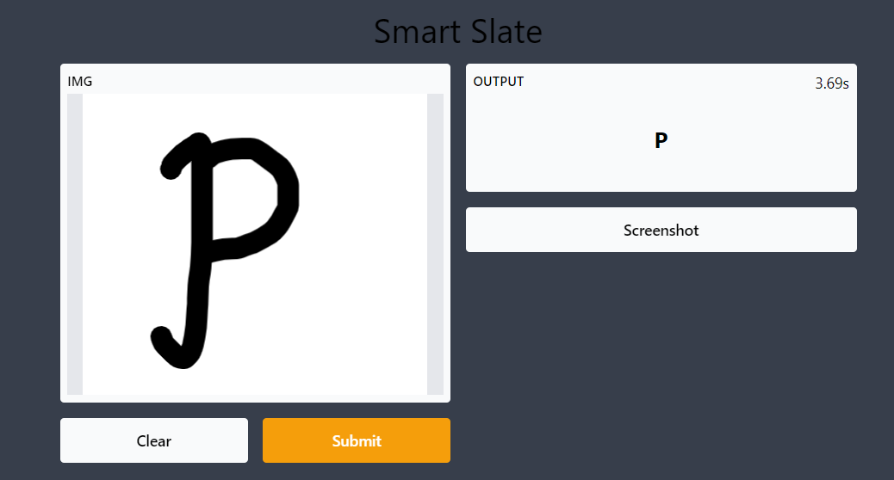

# Hand-Written-Alphabet-Recognition

This project is a handwritten alphabet recognition system that uses neural networks to identify handwritten letters. The system is trained on a dataset of handwritten letters from the MNIST database, and can recognize letters drawn by users in real-time.

**Features**  
**Handwritten alphabet recognition:** the system can recognize handwritten letters drawn by users in real-time.  
**Dataset training:** the system is trained on a dataset of handwritten letters from the MNIST database.  
**Neural network model:** the system uses a neural network model to recognize letters.  

**How it works**  
The handwritten alphabet recognition system is built using Python and the TensorFlow library for deep learning. The system is trained on a dataset of handwritten letters from the MNIST database, which contains 60,000 training images and 10,000 testing images of handwritten digits and letters.

The system uses a convolutional neural network (CNN) to recognize the handwritten letters. The CNN consists of multiple convolutional layers, pooling layers, and fully connected layers. The input to the CNN is a grayscale image of a handwritten letter, which is processed by the convolutional layers to extract features. The output of the CNN is a probability distribution over the possible letters.

The system is trained using the training dataset from MNIST, and the weights of the CNN are updated using backpropagation. The trained model is then used to recognize handwritten letters drawn by users in real-time. The user draws a letter on the screen using the mouse, and the system processes the image and applies the trained neural network model to recognize the letter.

